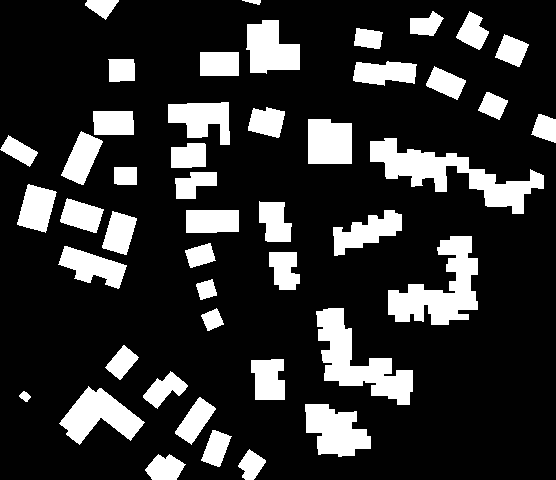
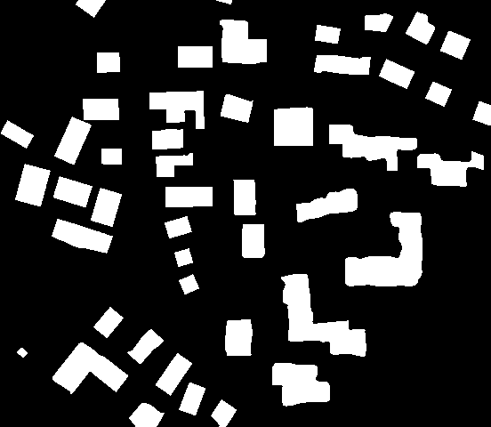
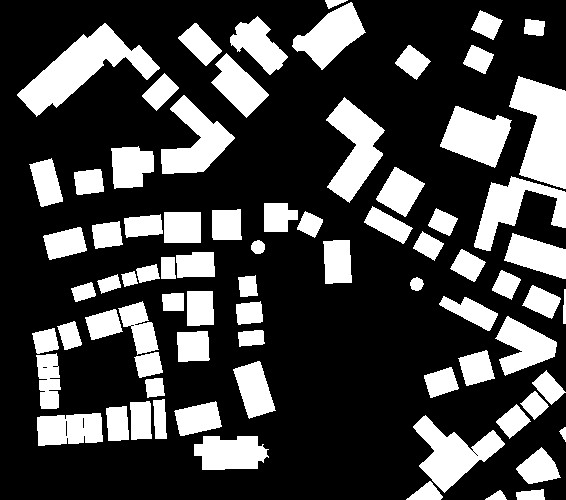
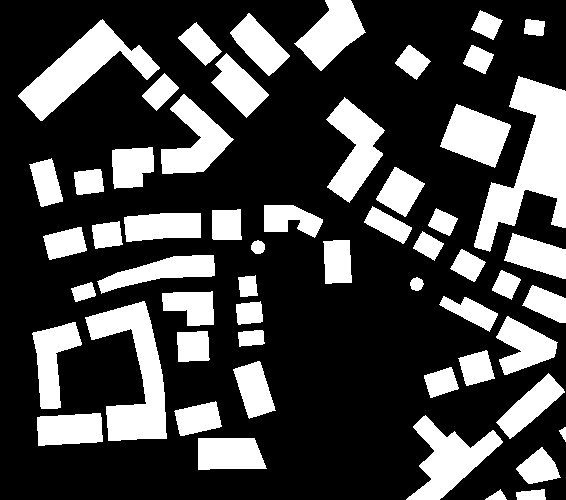
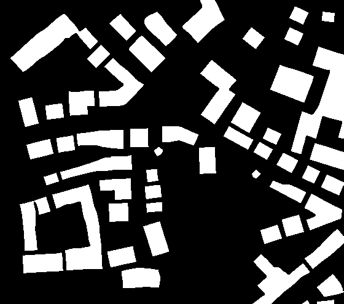
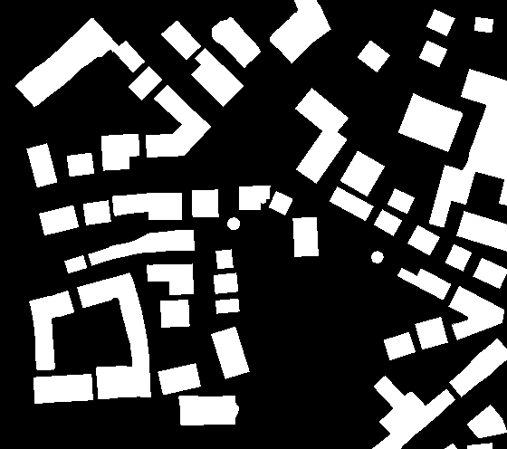

# Learn Cartographic Building Generalization with Deep Convolutional Neural Networks

### Introduction

Building simplification is conducted in this work using a fully conv layers with down-conv and up-conv. The original work was provided by a master thesis, which use the car trajectories to reconstruct the road networks.


<div align = 'center'>





<br>





</div>

### Setting for DCOS
```
{
  "id": "/yourname-1gpu",
  "backoffFactor": 1.15,
  "backoffSeconds": 1,
  "cmd": "",
  "container": {
    "type": "MESOS",
    "volumes": [],
    "docker": {
      "image": "tensorflow/tensorflow:1.5.0-gpu-py3",
      "forcePullImage": false,
      "parameters": []
    }
  },
  "cpus": 1,
  "disk": 0,
  "instances": 0,
  "maxLaunchDelaySeconds": 3600,
  "mem": 10000,
  "gpus": 1,
  "networks": [
    {
      "mode": "host"
    }
  ],
  "portDefinitions": [],
  "requirePorts": false,
  "upgradeStrategy": {
    "maximumOverCapacity": 1,
    "minimumHealthCapacity": 1
  },
  "killSelection": "YOUNGEST_FIRST",
  "unreachableStrategy": {
    "inactiveAfterSeconds": 0,
    "expungeAfterSeconds": 0
  },
  "healthChecks": [],
  "fetch": [],
  "constraints": []
}
```

### Connect to DCOS instance via Windows

1. Install Docker (https://www.docker.com/get-docker ) under Windows.

2. Dowload a docker image and start an instance according to this image (z.B. tensorflow/tensorflow:1.5.0-gpu ).

- First time run it
```
docker pull tensorflow/tensorflow:1.5.0-gpu                   // Download a docker image from dockerhub
docker run tensorflow/tensorflow:1.5.0-gpu                    // Run this docker iamge
docker ps                                                     // See your current working instance name
winpty docker exec -it yourDockerInstanceName bash            // Run bash on this instance
```

- Latter run it (After you restart your PC)
```
docker ps  -a                                                 // See your already shut down working instance name
docker start yourDockerInstanceName                           // Start your instance of the downloaded image
winpty docker exec -it yourDockerInstanceName bash            // Run  bash on this instance
```

3. Install dcos tool at this local docker instance with the following code (Latter do not need to install it again)
```
[ -d /usr/local/bin ] || mkdir -p /usr/local/bin && 
curl https://downloads.dcos.io/binaries/cli/linux/x86-64/dcos-1.10/dcos -o dcos && 
mv dcos /usr/local/bin && 
chmod +x /usr/local/bin/dcos && 
dcos cluster setup http://130.75.51.24 && 
dcos
```
4.  Open the GPU instance at DCOS
```
dcos task exec -it myname-2gpu bash
```


### Dependencies and Settings

Install the dependcies and set up connecting folder
```
export LD_LIBRARY_PATH=$LD_LIBRARY_PATH:/usr/local/nvidia/lib64 &&
export PATH=$PATH:/usr/local/nvidia/bin:/usr/local/sbin:/usr/sbin:/sbin &&
apt-get update &&
apt-get install cifs-utils -y &&
apt-get install git -y &&
apt-get install python3-pip -y &&
pip3 install keras &&
apt-get install python3-tk -y &&
apt-get install python3-skimage -y &&
apt install gdal-bin python-gdal python3-gdal -y &&
git clone https://www.github.com/keras-team/keras-contrib.git &&
cd keras-contrib &&
python3 setup.py install &&
cd ../ &&
mkdir tmp &&
mount -t cifs -o user=,password= //130.75.51.38/tmp/yu tmp &&
cd tmp 

git clone https://www.github.com/keras-team/keras-contrib.git
cd keras-contrib
python setup.py install

```
Run a python script and delete the DCOS instance after it finished (Optional)
```
python3 simply.py
curl -X DELETE http://130.75.51.24/marathon/v2/apps/yourinstancename
```

### Git Commands

```
git add -A && git commit -m "Your Message"
```
